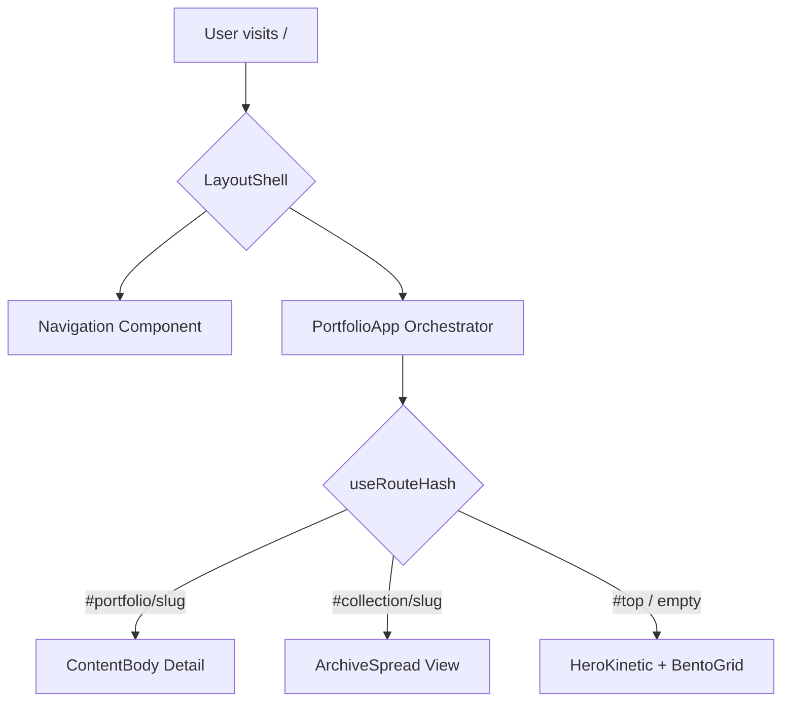
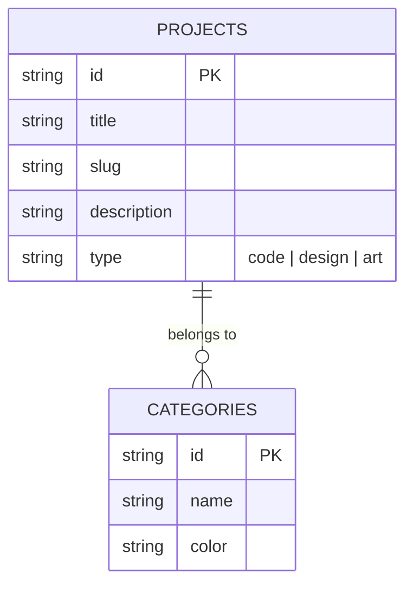

# Project Architecture Document (PAD) — Nicholas Yun Portfolio

This document serves as the single source-of-truth handbook for the Nicholas Yun Portfolio (v2.0) Next.js port.

## 1. System Architecture Overview

The project is structured as a **Hybrid SPA/SSR Application** within the Next.js App Router environment.

- **Next.js App Router**: Provides the structural skeleton, SEO metadata, and global styling.
- **Client-Side SPA Orchestrator**: Manages the complex state-driven transitions, kinetic typography, and hash-based navigation that define the "digital installation" experience.
- **Data Ingestion**: Content is statically defined in TypeScript to ensure ultra-fast load times and zero-JS waterfalls, while the backend (PostgreSQL/Drizzle) is prepared for future dynamic features.

## 2. File Hierarchy & Key Components

```text
📂 root/
├── 📂 src/
│   ├── 📂 app/                 # Next.js App Router Core
│   │   ├── 📄 layout.tsx       # Global fonts, metadata, theme provider
│   │   ├── 📄 page.tsx         # Main entry point (to render PortfolioApp)
│   │   └── 📄 globals.css      # Design System (Tailwind v4 theme + visible grid)
│   ├── 📂 components/          # Brutalist UI Component Library
│   │   ├── 📄 LayoutShell.tsx  # Perimeter frame & grid management
│   │   ├── 📄 HeroKinetic.tsx  # Scroll-velocity typography orchestrator
│   │   ├── 📄 BentoGrid.tsx    # Asymmetric content grid
│   │   ├── 📄 AboutFlow.tsx    # Interactive pillar navigation
│   │   └── 📄 ArchiveSpread.tsx # Collection detail browser
│   ├── 📂 hooks/               # Interaction Logic
│   │   ├── 📄 useRouteHash.ts  # SPA routing via window.location.hash
│   │   └── 📄 useWeightedScroll.ts # Velocity mapping for typography
│   ├── 📂 lib/                 # Content & Types
│   │   ├── 📄 content.ts       # Portfolio & Collection static data
│   │   └── 📄 data.ts          # Hero slides & layout configuration
│   └── 📂 db/                  # Data Layer
│       └── 📄 schema.ts        # Drizzle database definitions
```

## 3. Application Flow

### 3.1. Routing & Navigation
The application uses hash-based routing to maintain SPA state transitions without full page reloads.



### 3.2. Visual System: The 28px Grid
All components must align to the `28px` unit defined in `globals.css`.

```css
@theme {
  --unit: 28px;
  --spacing-grid: 28px;
}
```

## 4. Database Schema

The schema is defined using **Drizzle ORM** for PostgreSQL.



## 5. Development Conventions

1. **Zero Border Radius**: Enforced via `globals.css` using `border-radius: 0px !important`.
2. **Kinetic Weights**: Heading weights are dynamically mapped to scroll velocity (200-950).
3. **Machine Mode (MX)**: A high-utility terminal overlay for diagnostic and deeper content exploration.
4. **Theme Transitions**: Class-based theme switching (`theme-night` vs `theme-day`) with 600ms easing.

## 6. Known Issues & Outstanding Tasks

- **[CRITICAL] Orchestrator Missing**: `src/components/PortfolioApp.tsx` must be implemented to connect the UI components.
- **[CRITICAL] Entry Point Placeholder**: `src/app/page.tsx` must be updated to render the orchestrator.
- **Drizzle Integration**: The `HomePage` currently executes a raw SQL check; this should be integrated into the portfolio content flow if dynamic features are enabled.
